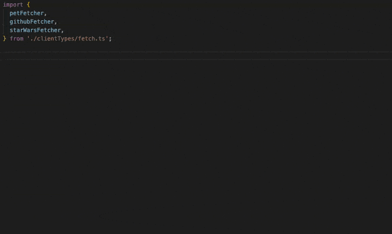

# swagger2types

<p align="center">
	<a href="http://npmjs.com/package/swagger2types"></a>
	
</p>

A TypeScript utility that converts Swagger/OpenAPI specifications into pure TypeScript types for type-safe API route handling. The generated types are completely erased at runtime, adding zero overhead to your JavaScript bundle.

## Overview

`swagger2types` transforms your Swagger/OpenAPI specs into a structured TypeScript interface that provides:

- **Request/Response type mapping** for each endpoint
- **Type-safe route definitions** with body, query, header, and parameter types
- **Zero runtime cost** - all types are erased during compilation

## Before You Start

**This is an advanced TypeScript tool** that requires some understanding of:
- TypeScript generics and mapped types
- API client patterns and HTTP libraries
- OpenAPI/Swagger specifications

**Not a traditional API client library** - `swagger2types` generates only TypeScript types. You'll need to implement your own API calling logic or use the provided helper utilities.

**Best suited for developers who:**
- Want maximum control over their API client implementation
- Value minimal bundle size and runtime overhead
- Are comfortable with advanced TypeScript patterns
- Prefer explicit API structure over abstracted method names

**New to TypeScript or API clients?** Consider starting with a full-featured library like `swagger-typescript-api` or `openapi-generator` before exploring this minimal approach.

Ready to proceed? Continue reading to understand how `swagger2types` works and see the [examples](./examples/) for complete implementations.

## Installation

```bash
npm install swagger2types
```

## Usage

### CLI Usage

```bash
# From a local file
swagger2types ./api-spec.json > generated/my-api.ts

# From a URL
swagger2types https://api.example.com/swagger.json > generated/my-api.ts

# From stdin
cat api-spec.json | swagger2types > generated/my-api.ts
```

### Programmatic Usage

```typescript
import { generate } from 'swagger2types';
import { writeFileSync } from 'fs';

const spec = {
  // Your Swagger/OpenAPI spec
  openapi: '3.0.0',
  // ... rest of spec
};

const generated = await generate(spec);
writeFileSync('./generated/my-api.ts', generated);
```

## Generated Type Structure

The tool generates a `Routes` type that maps each API endpoint to its request and response types:

```typescript
export type Routes = {
  /** Get a list of users with optional pagination */
  ['GET /users']: {
    Request: {
      query?: { page?: number; limit?: number };
    };
    Response: User[];
  };

  /** Create a new post for a specific user */
  ['POST /users/${userId}/posts']: {
    Request: {
      params: { userId: string };
      body: CreatePostRequest;
    };
    Response: Post;
  };

  // ... more routes
};
```

Each route includes JSDoc comments from your OpenAPI spec's `description` or `summary` fields, plus request types with only the properties it actually uses:
- `params` - Path parameters (e.g., `${userId}`)
- `query` - Query string parameters
- `headers` - Required headers
- `body` - Request body for POST/PUT/PATCH operations

## But Why?

### Preserves Your API Structure

Other generators create method-based clients (`client.getUser(id)`) that obscure the actual API structure. You end up hunting through documentation to figure out which method maps to `GET /api/users/{userId}`.

`swagger2types` keeps it simple: you work directly with routes as they appear in your API documentation. No abstraction layer, no guessing.

### Minimal Bundle Impact

Traditional generators produce massive amounts of runtime code. For example, `swagger-typescript-api` generates over 1MB of TypeScript code for the GitHub API, resulting in 200KB+ of minified JavaScript that ships to users.

`swagger2types` generates only type definitions that disappear at compile time. Your bundle impact stays under 1KB regardless of API size - whether you have 10 endpoints or 1,000.

**Real-world comparison** using our [vite-project example](./examples/vite-project/):

```
dist/assets/swagger2types-BkBWp9Hm.js             1.64 kB │ gzip:  0.87 kB
dist/assets/swagger-typescript-api-t86z52Ap.js  183.91 kB │ gzip: 19.89 kB
```

### Maximum Flexibility

Choose your own HTTP client, error handling, response processing, and integration approach. Works seamlessly with any framework (React, Vue, Angular, Express, Next.js) and module system (ESM, CJS).

Integrate gradually with existing codebases - no need to refactor everything to use a specific client library. The [examples](./examples/esm/clientTypes/) show different approaches you can adapt.

## Complete Example

Here's the typical workflow from spec to type-safe API calls:

### 1. Generate Types
```bash
swagger2types https://petstore.swagger.io/v2/swagger.json > petstore-types.ts
```

### 2. Create Your Client
Copy the helper utilities from [`swagger-utils.ts`](./examples/esm/swagger-utils.ts) and create a client:

```typescript
import { clientFromFetch } from './swagger-utils.ts';
import type { Routes } from './petstore-types.ts';

export const petstore = clientFromFetch<Routes>({
  baseUrl: 'https://petstore.swagger.io/v2/',
});
```

### 3. Make Type-Safe API Calls
```typescript
// Full type safety with autocomplete
const pet = await petstore('GET /pet/${petId}', {
  params: { petId: 1 }
});

const newPet = await petstore('POST /pet', {
  body: {
    name: 'Fluffy',
    category: { id: 1, name: 'cats' },
    status: 'available'
  }
});
```



## Examples & Resources

**Working Examples:**
- **[ESM Example](./examples/esm/)** - Modern ES modules with GitHub, Petstore, and Star Wars APIs
- **[CJS Example](./examples/cjs/)** - CommonJS usage with GitHub API
- **[Vite Project](./examples/vite-project/)** - React app with bundle size comparison
- **[Client Types](./examples/esm/clientTypes/)** - Ready-to-use clients for fetch, axios, got, and Node.js HTTP

**Try it now:** [Interactive example on StackBlitz](https://stackblitz.com/github/kolodny/swagger2types?file=examples%2Fesm%2FclientTypes%2Ffetch.ts)

## How It Works

1. **Spec Processing** - Accepts OpenAPI/Swagger specifications with full TypeScript typing
2. **Code Generation** - Uses `swagger-typescript-api` with a custom template to generate pure types
3. **Route Mapping** - Creates a structured `Routes` type mapping each endpoint to request/response types
4. **Type Extraction** - Strips runtime code and exports only the type definitions

## Development

```bash
# Install dependencies
npm install

# Build the project
npm run build

# Run tests
npm test

# Test individual module systems
npm run test:esm
npm run test:cjs
```

## License

MIT

## Contributing

Contributions are welcome! Please feel free to submit issues and pull requests.
